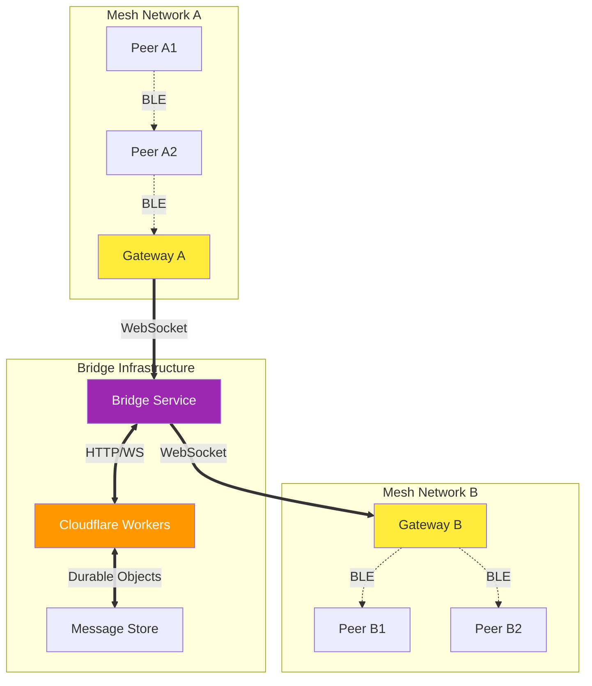

# bitchat Bridge Implementation Plan

## Overview

This document outlines the implementation of a bridge service that connects isolated bitchat mesh networks via internet infrastructure. The bridge will be implemented as a standalone service using Bun and TypeScript with zero dependencies, deployable on Cloudflare Workers or similar platforms.

## Architecture

### High-Level Design



### Component Breakdown

1. **Bridge Service**: Cloudflare Worker handling message routing
2. **Gateway Clients**: Modified bitchat apps with bridge connectivity
3. **Message Store**: Durable Objects for temporary message storage
4. **WebSocket Connections**: Real-time bidirectional communication

## Bridge Service Implementation

### Core Service Structure

```typescript
// bridge-worker.ts
interface BridgeMessage {
  id: string;
  type: 'MESH_MESSAGE' | 'BRIDGE_CONTROL' | 'HEARTBEAT';
  timestamp: number;
  ttl: number;
  payload: Uint8Array;
  signature?: Uint8Array;
  sourceNetwork: string;
  targetNetwork?: string;
}

interface NetworkConnection {
  id: string;
  websocket: WebSocket;
  lastSeen: number;
  networkId: string;
  isActive: boolean;
}

class BridgeService {
  private connections = new Map<string, NetworkConnection>();
  private messageStore: DurableObjectNamespace;
  
  async handleRequest(request: Request): Promise<Response> {
    const url = new URL(request.url);
    
    if (url.pathname === '/bridge/connect') {
      return this.handleWebSocketUpgrade(request);
    }
    
    if (url.pathname === '/bridge/status') {
      return this.handleStatusRequest();
    }
    
    return new Response('Not Found', { status: 404 });
  }
  
  private async handleWebSocketUpgrade(request: Request): Promise<Response> {
    const upgradeHeader = request.headers.get('Upgrade');
    if (upgradeHeader !== 'websocket') {
      return new Response('Expected websocket', { status: 400 });
    }
    
    const [client, server] = Object.values(new WebSocketPair());
    
    const connectionId = this.generateConnectionId();
    const networkId = this.extractNetworkId(request);
    
    const connection: NetworkConnection = {
      id: connectionId,
      websocket: server,
      lastSeen: Date.now(),
      networkId,
      isActive: true
    };
    
    this.connections.set(connectionId, connection);
    this.setupWebSocketHandlers(connection);
    
    return new Response(null, {
      status: 101,
      webSocket: client
    });
  }
  
  private setupWebSocketHandlers(connection: NetworkConnection): void {
    connection.websocket.addEventListener('message', async (event) => {
      try {
        const message = this.parseMessage(event.data);
        await this.routeMessage(message, connection);
      } catch (error) {
        console.error('Message handling error:', error);
      }
    });
    
    connection.websocket.addEventListener('close', () => {
      this.connections.delete(connection.id);
    });
    
    connection.websocket.addEventListener('error', (error) => {
      console.error('WebSocket error:', error);
      this.connections.delete(connection.id);
    });
  }
  
  private async routeMessage(message: BridgeMessage, source: NetworkConnection): Promise<void> {
    // Update connection activity
    source.lastSeen = Date.now();
    
    switch (message.type) {
      case 'MESH_MESSAGE':
        await this.relayMeshMessage(message, source);
        break;
      case 'BRIDGE_CONTROL':
        await this.handleControlMessage(message, source);
        break;
      case 'HEARTBEAT':
        await this.handleHeartbeat(message, source);
        break;
    }
  }
  
  private async relayMeshMessage(message: BridgeMessage, source: NetworkConnection): Promise<void> {
    // Decrement TTL
    message.ttl--;
    if (message.ttl <= 0) {
      return;
    }
    
    // Store message for offline networks
    await this.storeMessage(message);
    
    // Relay to other networks
    for (const [connectionId, connection] of this.connections) {
      if (connectionId !== source.id && 
          connection.isActive && 
          connection.networkId !== source.networkId) {
        
        try {
          connection.websocket.send(this.serializeMessage(message));
        } catch (error) {
          console.error('Failed to relay message:', error);
          connection.isActive = false;
        }
      }
    }
  }
  
  private async storeMessage(message: BridgeMessage): Promise<void> {
    const messageStore = this.messageStore.get(this.messageStore.idFromName('global'));
    await messageStore.fetch('https://dummy/store', {
      method: 'POST',
      body: JSON.stringify(message)
    });
  }
  
  private parseMessage(data: string | ArrayBuffer): BridgeMessage {
    if (typeof data === 'string') {
      return JSON.parse(data);
    }
    
    // Handle binary protocol
    const view = new DataView(data as ArrayBuffer);
    let offset = 0;
    
    const id = this.readString(view, offset, 16);
    offset += 16;
    
    const type = this.readUint8(view, offset) as BridgeMessage['type'];
    offset += 1;
    
    const timestamp = this.readUint64(view, offset);
    offset += 8;
    
    const ttl = this.readUint8(view, offset);
    offset += 1;
    
    const payloadLength = this.readUint32(view, offset);
    offset += 4;
    
    const payload = new Uint8Array(data as ArrayBuffer, offset, payloadLength);
    offset += payloadLength;
    
    return {
      id,
      type,
      timestamp,
      ttl,
      payload,
      sourceNetwork: '', // Will be set by connection context
    };
  }
  
  private serializeMessage(message: BridgeMessage): ArrayBuffer {
    const payloadLength = message.payload.length;
    const totalLength = 16 + 1 + 8 + 1 + 4 + payloadLength;
    
    const buffer = new ArrayBuffer(totalLength);
    const view = new DataView(buffer);
    let offset = 0;
    
    this.writeString(view, offset, message.id, 16);
    offset += 16;
    
    this.writeUint8(view, offset, this.getTypeValue(message.type));
    offset += 1;
    
    this.writeUint64(view, offset, message.timestamp);
    offset += 8;
    
    this.writeUint8(view, offset, message.ttl);
    offset += 1;
    
    this.writeUint32(view, offset, payloadLength);
    offset += 4;
    
    new Uint8Array(buffer, offset).set(message.payload);
    
    return buffer;
  }
  
  private generateConnectionId(): string {
    return Array.from(crypto.getRandomValues(new Uint8Array(8)))
      .map(b => b.toString(16).padStart(2, '0'))
      .join('');
  }
  
  private extractNetworkId(request: Request): string {
    const url = new URL(request.url);
    return url.searchParams.get('networkId') || 'unknown';
  }
  
  // Utility methods for binary protocol
  private readString(view: DataView, offset: number, length: number): string {
    const bytes = new Uint8Array(view.buffer, offset, length);
    return new TextDecoder().decode(bytes).replace(/\0+$/, '');
  }
  
  private readUint8(view: DataView, offset: number): number {
    return view.getUint8(offset);
  }
  
  private readUint32(view: DataView, offset: number): number {
    return view.getUint32(offset, false); // Big endian
  }
  
  private readUint64(view: DataView, offset: number): number {
    return view.getBigUint64(offset, false); // Big endian
  }
  
  private writeString(view: DataView, offset: number, str: string, length: number): void {
    const bytes = new TextEncoder().encode(str);
    const target = new Uint8Array(view.buffer, offset, length);
    target.fill(0);
    target.set(bytes.slice(0, length));
  }
  
  private writeUint8(view: DataView, offset: number, value: number): void {
    view.setUint8(offset, value);
  }
  
  private writeUint32(view: DataView, offset: number, value: number): void {
    view.setUint32(offset, value, false); // Big endian
  }
  
  private writeUint64(view: DataView, offset: number, value: number): void {
    view.setBigUint64(offset, BigInt(value), false); // Big endian
  }
  
  private getTypeValue(type: BridgeMessage['type']): number {
    const typeMap = {
      'MESH_MESSAGE': 0x01,
      'BRIDGE_CONTROL': 0x02,
      'HEARTBEAT': 0x03
    };
    return typeMap[type] || 0x00;
  }
}
```

### Message Store (Durable Object)

```typescript
// message-store.ts
interface StoredMessage {
  id: string;
  message: BridgeMessage;
  expiresAt: number;
  targetNetworks: string[];
}

export class MessageStore {
  private state: DurableObjectState;
  private messages = new Map<string, StoredMessage>();
  
  constructor(state: DurableObjectState) {
    this.state = state;
    this.loadMessages();
  }
  
  async fetch(request: Request): Promise<Response> {
    const url = new URL(request.url);
    
    switch (url.pathname) {
      case '/store':
        return this.handleStoreMessage(request);
      case '/retrieve':
        return this.handleRetrieveMessages(request);
      case '/cleanup':
        return this.handleCleanup();
      default:
        return new Response('Not Found', { status: 404 });
    }
  }
  
  private async handleStoreMessage(request: Request): Promise<Response> {
    const message: BridgeMessage = await request.json();
    
    const storedMessage: StoredMessage = {
      id: message.id,
      message,
      expiresAt: Date.now() + (12 * 60 * 60 * 1000), // 12 hours
      targetNetworks: message.targetNetwork ? [message.targetNetwork] : []
    };
    
    this.messages.set(message.id, storedMessage);
    await this.persistMessages();
    
    return new Response('Stored', { status: 200 });
  }
  
  private async handleRetrieveMessages(request: Request): Promise<Response> {
    const url = new URL(request.url);
    const networkId = url.searchParams.get('networkId');
    
    if (!networkId) {
      return new Response('Network ID required', { status: 400 });
    }
    
    const messages = Array.from(this.messages.values())
      .filter(stored => 
        stored.targetNetworks.length === 0 || 
        stored.targetNetworks.includes(networkId)
      )
      .map(stored => stored.message);
    
    return new Response(JSON.stringify(messages), {
      headers: { 'Content-Type': 'application/json' }
    });
  }
  
  private async handleCleanup(): Promise<Response> {
    const now = Date.now();
    let cleaned = 0;
    
    for (const [id, stored] of this.messages) {
      if (stored.expiresAt < now) {
        this.messages.delete(id);
        cleaned++;
      }
    }
    
    if (cleaned > 0) {
      await this.persistMessages();
    }
    
    return new Response(`Cleaned ${cleaned} messages`, { status: 200 });
  }
  
  private async loadMessages(): Promise<void> {
    const stored = await this.state.storage.get('messages');
    if (stored) {
      this.messages = new Map(Object.entries(stored));
    }
  }
  
  private async persistMessages(): Promise<void> {
    const data = Object.fromEntries(this.messages);
    await this.state.storage.put('messages', data);
  }
}
```

## Deployment Configuration

### Cloudflare Workers Setup

```typescript
// wrangler.toml
name = "bitchat-bridge"
main = "src/index.ts"
compatibility_date = "2024-01-01"

[durable_objects]
bindings = [
  { name = "MESSAGE_STORE", class_name = "MessageStore" }
]

[[migrations]]
tag = "v1"
new_classes = ["MessageStore"]

[env.production]
vars = { ENVIRONMENT = "production" }

[env.staging]
vars = { ENVIRONMENT = "staging" }
```

### Package Configuration

```json
{
  "name": "bitchat-bridge",
  "version": "1.0.0",
  "description": "Bridge service for bitchat mesh networks",
  "main": "src/index.ts",
  "scripts": {
    "dev": "wrangler dev",
    "deploy": "wrangler deploy",
    "deploy:staging": "wrangler deploy --env staging",
    "test": "bun test"
  },
  "devDependencies": {
    "@cloudflare/workers-types": "^4.20240117.0",
    "bun-types": "latest"
  },
  "peerDependencies": {
    "typescript": "^5.0.0"
  }
}
```

### Entry Point

```typescript
// src/index.ts
import { BridgeService } from './bridge-worker';
import { MessageStore } from './message-store';

export default {
  async fetch(request: Request, env: Env, ctx: ExecutionContext): Promise<Response> {
    const service = new BridgeService();
    service.messageStore = env.MESSAGE_STORE;
    return service.handleRequest(request);
  }
};

export { MessageStore };
```

## Security Considerations

### Authentication & Authorization

```typescript
interface BridgeAuth {
  networkId: string;
  publicKey: string;
  signature: string;
  timestamp: number;
}

class AuthService {
  static async validateConnection(auth: BridgeAuth): Promise<boolean> {
    // Verify signature
    const message = `${auth.networkId}:${auth.timestamp}`;
    const isValid = await this.verifySignature(
      message, 
      auth.signature, 
      auth.publicKey
    );
    
    // Check timestamp (prevent replay attacks)
    const now = Date.now();
    const maxAge = 5 * 60 * 1000; // 5 minutes
    const timestampValid = Math.abs(now - auth.timestamp) < maxAge;
    
    return isValid && timestampValid;
  }
  
  private static async verifySignature(
    message: string, 
    signature: string, 
    publicKey: string
  ): Promise<boolean> {
    // Ed25519 signature verification using Web Crypto API
    const key = await crypto.subtle.importKey(
      'raw',
      this.hexToBytes(publicKey),
      { name: 'Ed25519' },
      false,
      ['verify']
    );
    
    return crypto.subtle.verify(
      'Ed25519',
      key,
      this.hexToBytes(signature),
      new TextEncoder().encode(message)
    );
  }
  
  private static hexToBytes(hex: string): Uint8Array {
    return new Uint8Array(hex.match(/.{2}/g)!.map(byte => parseInt(byte, 16)));
  }
}
```

### Rate Limiting

```typescript
class RateLimiter {
  private static readonly LIMITS = {
    MESSAGES_PER_MINUTE: 100,
    CONNECTIONS_PER_IP: 5,
    BANDWIDTH_PER_MINUTE: 1024 * 1024 // 1MB
  };
  
  static async checkLimits(
    connectionId: string, 
    clientIP: string, 
    messageSize: number
  ): Promise<boolean> {
    // Implementation using Durable Objects for distributed rate limiting
    // This would track per-connection and per-IP metrics
    return true; // Simplified for example
  }
}
```

## Monitoring & Observability

### Metrics Collection

```typescript
interface BridgeMetrics {
  connectionsActive: number;
  messagesRelayed: number;
  messagesStored: number;
  bandwidthUsed: number;
  errorCount: number;
  latencyP95: number;
}

class MetricsCollector {
  static async recordMetric(name: string, value: number, tags?: Record<string, string>): Promise<void> {
    // Send to Cloudflare Analytics or external monitoring
    console.log(`Metric: ${name}=${value}`, tags);
  }
  
  static async recordConnection(networkId: string): Promise<void> {
    await this.recordMetric('bridge.connections.active', 1, { networkId });
  }
  
  static async recordMessage(size: number, ttl: number): Promise<void> {
    await this.recordMetric('bridge.messages.relayed', 1);
    await this.recordMetric('bridge.bandwidth.used', size);
    await this.recordMetric('bridge.message.ttl', ttl);
  }
}
```

## Testing Strategy

### Unit Tests

```typescript
// tests/bridge-service.test.ts
import { describe, it, expect, beforeEach } from 'bun:test';
import { BridgeService } from '../src/bridge-worker';

describe('BridgeService', () => {
  let service: BridgeService;
  
  beforeEach(() => {
    service = new BridgeService();
  });
  
  it('should handle WebSocket upgrade', async () => {
    const request = new Request('https://bridge.example.com/bridge/connect', {
      headers: { 'Upgrade': 'websocket' }
    });
    
    const response = await service.handleRequest(request);
    expect(response.status).toBe(101);
  });
  
  it('should parse binary messages correctly', () => {
    const message = {
      id: 'test-message-id',
      type: 'MESH_MESSAGE' as const,
      timestamp: Date.now(),
      ttl: 5,
      payload: new Uint8Array([1, 2, 3, 4]),
      sourceNetwork: 'test-network'
    };
    
    const serialized = service.serializeMessage(message);
    const parsed = service.parseMessage(serialized);
    
    expect(parsed.id).toBe(message.id);
    expect(parsed.type).toBe(message.type);
    expect(parsed.ttl).toBe(message.ttl);
  });
});
```

### Integration Tests

```typescript
// tests/integration.test.ts
import { describe, it, expect } from 'bun:test';

describe('Bridge Integration', () => {
  it('should relay messages between networks', async () => {
    // Test full message flow through bridge
    // This would use test WebSocket connections
  });
  
  it('should store messages for offline networks', async () => {
    // Test store-and-forward functionality
  });
  
  it('should handle connection failures gracefully', async () => {
    // Test resilience and error handling
  });
});
```

## Performance Optimization

### Connection Pooling

```typescript
class ConnectionPool {
  private static readonly MAX_CONNECTIONS = 1000;
  private static readonly IDLE_TIMEOUT = 30 * 60 * 1000; // 30 minutes
  
  static async manageConnections(): Promise<void> {
    // Implement connection lifecycle management
    // Close idle connections, enforce limits
  }
}
```

### Message Batching

```typescript
class MessageBatcher {
  private static readonly BATCH_SIZE = 10;
  private static readonly BATCH_TIMEOUT = 100; // ms
  
  static async batchMessages(messages: BridgeMessage[]): Promise<void> {
    // Batch multiple small messages for efficiency
    // Reduce WebSocket overhead
  }
}
```

## Deployment Checklist

- [ ] Configure Cloudflare Workers environment
- [ ] Set up Durable Objects for message storage
- [ ] Configure domain and SSL certificates
- [ ] Set up monitoring and alerting
- [ ] Deploy rate limiting and security measures
- [ ] Test WebSocket connectivity
- [ ] Verify message routing and storage
- [ ] Load test with multiple connections
- [ ] Set up backup and disaster recovery
- [ ] Document API endpoints and usage

## Cost Estimation

### Cloudflare Workers Pricing

- **Requests**: $0.50 per million requests
- **Duration**: $12.50 per million GB-seconds
- **Durable Objects**: $0.15 per million requests + $0.20 per GB-month storage

### Expected Usage

- **Small deployment** (10 networks, 100 users): ~$5-10/month
- **Medium deployment** (100 networks, 1000 users): ~$50-100/month
- **Large deployment** (1000 networks, 10000 users): ~$500-1000/month

## Future Enhancements

1. **Multi-region deployment** for reduced latency
2. **Message encryption at bridge level** for additional security
3. **Advanced routing algorithms** for optimal message delivery
4. **Integration with other protocols** (Matrix, XMPP, etc.)
5. **Mobile push notifications** for offline message delivery
6. **Web interface** for bridge management and monitoring

---

This implementation provides a robust, scalable bridge service that maintains bitchat's privacy and decentralization principles while enabling global connectivity when desired.