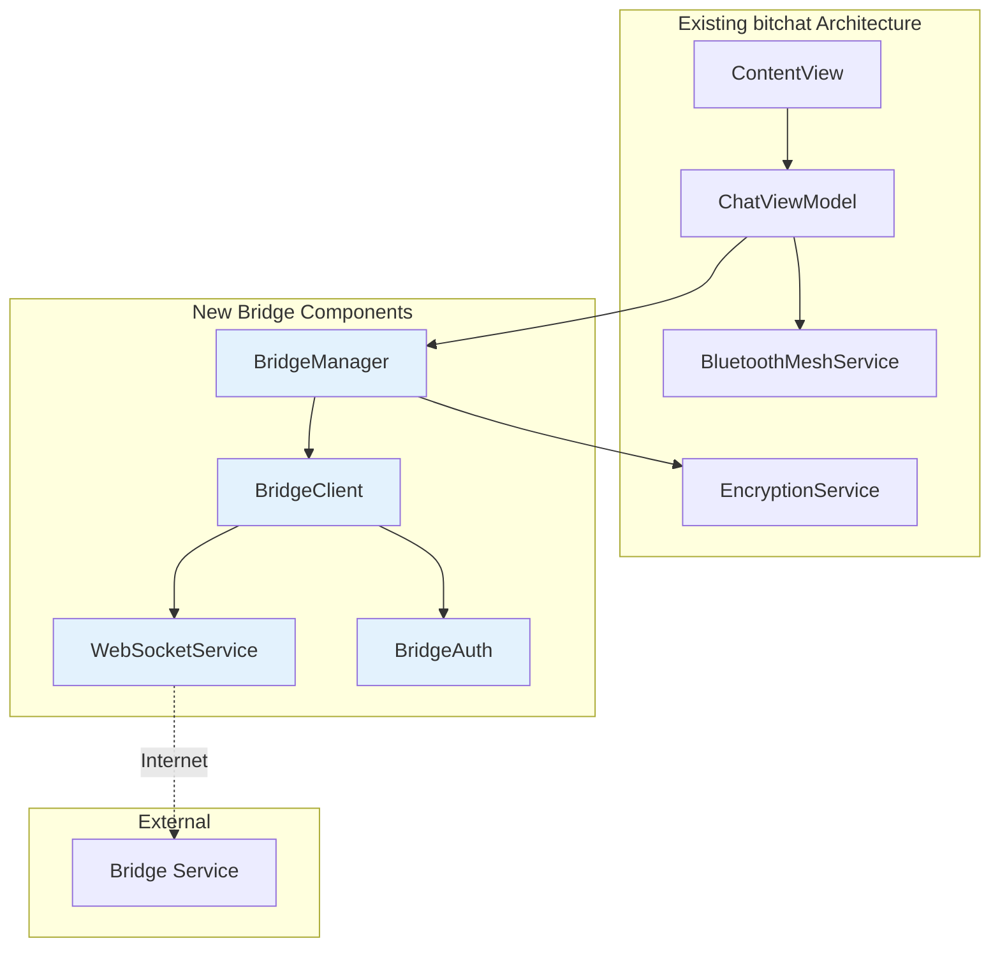

# bitchat Bridge Support Implementation

## Overview

This document outlines the implementation plan for adding bridge connectivity support to the bitchat iOS/macOS application. The bridge feature will allow users to optionally connect their local mesh networks to remote networks via internet infrastructure while maintaining privacy and security.

## Architecture Changes

### New Components



## Implementation Plan

### Phase 1: Core Bridge Infrastructure

#### 1.1 WebSocket Service

```swift
// Services/WebSocketService.swift
import Foundation
import Network

protocol WebSocketServiceDelegate: AnyObject {
    func webSocketDidConnect()
    func webSocketDidDisconnect(error: Error?)
    func webSocketDidReceiveMessage(_ data: Data)
}

class WebSocketService: NSObject, ObservableObject {
    weak var delegate: WebSocketServiceDelegate?
    private var webSocketTask: URLSessionWebSocketTask?
    private var urlSession: URLSession?
    private var isConnected = false
    
    @Published var connectionState: ConnectionState = .disconnected
    
    enum ConnectionState {
        case disconnected
        case connecting
        case connected
        case error(String)
    }
    
    func connect(to url: URL, with auth: BridgeAuth) {
        guard !isConnected else { return }
        
        connectionState = .connecting
        
        var request = URLRequest(url: url)
        request.setValue("websocket", forHTTPHeaderField: "Upgrade")
        request.setValue("bitchat-bridge/1.0", forHTTPHeaderField: "User-Agent")
        
        // Add authentication headers
        request.setValue(auth.networkId, forHTTPHeaderField: "X-Network-ID")
        request.setValue(auth.publicKey, forHTTPHeaderField: "X-Public-Key")
        request.setValue(auth.signature, forHTTPHeaderField: "X-Signature")
        request.setValue("\(auth.timestamp)", forHTTPHeaderField: "X-Timestamp")
        
        urlSession = URLSession(configuration: .default, delegate: self, delegateQueue: nil)
        webSocketTask = urlSession?.webSocketTask(with: request)
        webSocketTask?.resume()
        
        startReceiving()
        startHeartbeat()
    }
    
    func disconnect() {
        webSocketTask?.cancel(with: .goingAway, reason: nil)
        webSocketTask = nil
        urlSession = nil
        isConnected = false
        connectionState = .disconnected
    }
    
    func send(_ data: Data) {
        guard isConnected else { return }
        
        let message = URLSessionWebSocketTask.Message.data(data)
        webSocketTask?.send(message) { [weak self] error in
            if let error = error {
                print("WebSocket send error: \(error)")
                self?.connectionState = .error(error.localizedDescription)
            }
        }
    }
    
    private func startReceiving() {
        webSocketTask?.receive { [weak self] result in
            switch result {
            case .success(let message):
                switch message {
                case .data(let data):
                    self?.delegate?.webSocketDidReceiveMessage(data)
                case .string(let text):
                    if let data = text.data(using: .utf8) {
                        self?.delegate?.webSocketDidReceiveMessage(data)
                    }
                @unknown default:
                    break
                }
                self?.startReceiving() // Continue receiving
                
            case .failure(let error):
                print("WebSocket receive error: \(error)")
                self?.connectionState = .error(error.localizedDescription)
                self?.delegate?.webSocketDidDisconnect(error: error)
            }
        }
    }
    
    private func startHeartbeat() {
        Timer.scheduledTimer(withTimeInterval: 30.0, repeats: true) { [weak self] _ in
            guard self?.isConnected == true else { return }
            
            let heartbeat = BridgeMessage(
                id: UUID().uuidString,
                type: .heartbeat,
                timestamp: UInt64(Date().timeIntervalSince1970 * 1000),
                ttl: 1,
                payload: Data(),
                sourceNetwork: self?.getCurrentNetworkId() ?? ""
            )
            
            if let data = try? heartbeat.serialize() {
                self?.send(data)
            }
        }
    }
    
    private func getCurrentNetworkId() -> String {
        // Generate or retrieve current network identifier
        return "network-\(UIDevice.current.identifierForVendor?.uuidString.prefix(8) ?? "unknown")"
    }
}

extension WebSocketService: URLSessionWebSocketDelegate {
    func urlSession(_ session: URLSession, webSocketTask: URLSessionWebSocketTask, didOpenWithProtocol protocol: String?) {
        isConnected = true
        connectionState = .connected
        delegate?.webSocketDidConnect()
    }
    
    func urlSession(_ session: URLSession, webSocketTask: URLSessionWebSocketTask, didCloseWith closeCode: URLSessionWebSocketTask.CloseCode, reason: Data?) {
        isConnected = false
        connectionState = .disconnected
        delegate?.webSocketDidDisconnect(error: nil)
    }
}
```

#### 1.2 Bridge Authentication

```swift
// Services/BridgeAuth.swift
import Foundation
import CryptoKit

struct BridgeAuth {
    let networkId: String
    let publicKey: String
    let signature: String
    let timestamp: UInt64
    
    static func create(with keyPair: Curve25519.Signing.PrivateKey, networkId: String) throws -> BridgeAuth {
        let timestamp = UInt64(Date().timeIntervalSince1970 * 1000)
        let message = "\(networkId):\(timestamp)"
        let messageData = message.data(using: .utf8)!
        
        let signature = try keyPair.signature(for: messageData)
        let publicKey = keyPair.publicKey.rawRepresentation
        
        return BridgeAuth(
            networkId: networkId,
            publicKey: publicKey.hexString,
            signature: signature.hexString,
            timestamp: timestamp
        )
    }
}

extension Data {
    var hexString: String {
        return map { String(format: "%02x", $0) }.joined()
    }
}
```

#### 1.3 Bridge Message Protocol

```swift
// Protocols/BridgeMessage.swift
import Foundation

struct BridgeMessage: Codable {
    let id: String
    let type: MessageType
    let timestamp: UInt64
    let ttl: UInt8
    let payload: Data
    let sourceNetwork: String
    let targetNetwork: String?
    let signature: Data?
    
    enum MessageType: UInt8, Codable {
        case meshMessage = 0x01
        case bridgeControl = 0x02
        case heartbeat = 0x03
    }
    
    func serialize() throws -> Data {
        let payloadLength = UInt32(payload.count)
        let totalLength = 16 + 1 + 8 + 1 + 4 + payload.count + (signature?.count ?? 0)
        
        var data = Data(capacity: totalLength)
        
        // ID (16 bytes, padded)
        let idData = id.data(using: .utf8)?.prefix(16) ?? Data()
        data.append(idData)
        data.append(Data(count: 16 - idData.count)) // Padding
        
        // Type (1 byte)
        data.append(type.rawValue)
        
        // Timestamp (8 bytes, big endian)
        data.append(withUnsafeBytes(of: timestamp.bigEndian) { Data($0) })
        
        // TTL (1 byte)
        data.append(ttl)
        
        // Payload length (4 bytes, big endian)
        data.append(withUnsafeBytes(of: payloadLength.bigEndian) { Data($0) })
        
        // Payload
        data.append(payload)
        
        // Signature (optional)
        if let signature = signature {
            data.append(signature)
        }
        
        return data
    }
    
    static func deserialize(from data: Data) throws -> BridgeMessage {
        guard data.count >= 30 else { // Minimum size without payload
            throw BridgeError.invalidMessageFormat
        }
        
        var offset = 0
        
        // ID
        let idData = data.subdata(in: offset..<offset+16)
        let id = String(data: idData, encoding: .utf8)?.trimmingCharacters(in: .nullCharacters) ?? ""
        offset += 16
        
        // Type
        guard let type = MessageType(rawValue: data[offset]) else {
            throw BridgeError.invalidMessageType
        }
        offset += 1
        
        // Timestamp
        let timestamp = data.subdata(in: offset..<offset+8).withUnsafeBytes { $0.load(as: UInt64.self).bigEndian }
        offset += 8
        
        // TTL
        let ttl = data[offset]
        offset += 1
        
        // Payload length
        let payloadLength = data.subdata(in: offset..<offset+4).withUnsafeBytes { $0.load(as: UInt32.self).bigEndian }
        offset += 4
        
        // Payload
        guard offset + Int(payloadLength) <= data.count else {
            throw BridgeError.invalidMessageFormat
        }
        let payload = data.subdata(in: offset..<offset+Int(payloadLength))
        offset += Int(payloadLength)
        
        // Signature (remaining bytes)
        let signature = offset < data.count ? data.subdata(in: offset..<data.count) : nil
        
        return BridgeMessage(
            id: id,
            type: type,
            timestamp: timestamp,
            ttl: ttl,
            payload: payload,
            sourceNetwork: "", // Will be set by bridge context
            targetNetwork: nil,
            signature: signature
        )
    }
}

enum BridgeError: Error {
    case invalidMessageFormat
    case invalidMessageType
    case authenticationFailed
    case connectionFailed
}
```

#### 1.4 Bridge Client

```swift
// Services/BridgeClient.swift
import Foundation
import CryptoKit

protocol BridgeClientDelegate: AnyObject {
    func bridgeDidConnect(_ bridge: BridgeClient)
    func bridgeDidDisconnect(_ bridge: BridgeClient, error: Error?)
    func bridgeDidReceiveMessage(_ bridge: BridgeClient, message: BitchatPacket)
}

class BridgeClient: ObservableObject {
    weak var delegate: BridgeClientDelegate?
    private let webSocketService = WebSocketService()
    private let encryptionService: EncryptionService
    private var signingKey: Curve25519.Signing.PrivateKey
    
    @Published var isConnected = false
    @Published var bridgeURL: URL?
    @Published var connectionError: String?
    
    private var networkId: String {
        return "network-\(UIDevice.current.identifierForVendor?.uuidString.prefix(8) ?? "unknown")"
    }
    
    init(encryptionService: EncryptionService) {
        self.encryptionService = encryptionService
        self.signingKey = Curve25519.Signing.PrivateKey()
        
        webSocketService.delegate = self
    }
    
    func connect(to url: URL) {
        guard !isConnected else { return }
        
        do {
            let auth = try BridgeAuth.create(with: signingKey, networkId: networkId)
            bridgeURL = url
            webSocketService.connect(to: url, with: auth)
        } catch {
            connectionError = error.localizedDescription
        }
    }
    
    func disconnect() {
        webSocketService.disconnect()
        bridgeURL = nil
    }
    
    func sendMessage(_ packet: BitchatPacket) {
        guard isConnected else { return }
        
        do {
            // Convert BitchatPacket to BridgeMessage
            let bridgeMessage = BridgeMessage(
                id: UUID().uuidString,
                type: .meshMessage,
                timestamp: packet.timestamp,
                ttl: packet.ttl,
                payload: try packet.serialize(),
                sourceNetwork: networkId,
                targetNetwork: nil,
                signature: nil
            )
            
            let data = try bridgeMessage.serialize()
            webSocketService.send(data)
        } catch {
            print("Failed to send bridge message: \(error)")
        }
    }
}

extension BridgeClient: WebSocketServiceDelegate {
    func webSocketDidConnect() {
        DispatchQueue.main.async {
            self.isConnected = true
            self.connectionError = nil
        }
        delegate?.bridgeDidConnect(self)
    }
    
    func webSocketDidDisconnect(error: Error?) {
        DispatchQueue.main.async {
            self.isConnected = false
            if let error = error {
                self.connectionError = error.localizedDescription
            }
        }
        delegate?.bridgeDidDisconnect(self, error: error)
    }
    
    func webSocketDidReceiveMessage(_ data: Data) {
        do {
            let bridgeMessage = try BridgeMessage.deserialize(from: data)
            
            if bridgeMessage.type == .meshMessage {
                // Convert back to BitchatPacket
                let packet = try BitchatPacket.deserialize(from: bridgeMessage.payload)
                delegate?.bridgeDidReceiveMessage(self, message: packet)
            }
        } catch {
            print("Failed to process bridge message: \(error)")
        }
    }
}
```

### Phase 2: Bridge Manager Integration

#### 2.1 Bridge Manager

```swift
// Services/BridgeManager.swift
import Foundation

class BridgeManager: ObservableObject {
    @Published var activeBridges: [BridgeConnection] = []
    @Published var isEnabled = false
    
    private let encryptionService: EncryptionService
    private var bridgeClients: [String: BridgeClient] = [:]
    
    weak var meshService: BluetoothMeshService?
    
    struct BridgeConnection: Identifiable, Codable {
        let id = UUID()
        let url: URL
        let name: String
        let isConnected: Bool
        let lastConnected: Date?
        
        enum CodingKeys: String, CodingKey {
            case url, name, isConnected, lastConnected
        }
    }
    
    init(encryptionService: EncryptionService) {
        self.encryptionService = encryptionService
        loadBridgeConnections()
    }
    
    func addBridge(url: URL, name: String) {
        let connection = BridgeConnection(
            url: url,
            name: name,
            isConnected: false,
            lastConnected: nil
        )
        
        activeBridges.append(connection)
        saveBridgeConnections()
        
        if isEnabled {
            connectToBridge(connection)
        }
    }
    
    func removeBridge(id: UUID) {
        if let index = activeBridges.firstIndex(where: { $0.id == id }) {
            let connection = activeBridges[index]
            disconnectFromBridge(connection)
            activeBridges.remove(at: index)
            saveBridgeConnections()
        }
    }
    
    func enableBridges() {
        isEnabled = true
        UserDefaults.standard.set(true, forKey: "bridgeEnabled")
        
        for connection in activeBridges {
            connectToBridge(connection)
        }
    }
    
    func disableBridges() {
        isEnabled = false
        UserDefaults.standard.set(false, forKey: "bridgeEnabled")
        
        for connection in activeBridges {
            disconnectFromBridge(connection)
        }
    }
    
    private func connectToBridge(_ connection: BridgeConnection) {
        let client = BridgeClient(encryptionService: encryptionService)
        client.delegate = self
        
        bridgeClients[connection.id.uuidString] = client
        client.connect(to: connection.url)
    }
    
    private func disconnectFromBridge(_ connection: BridgeConnection) {
        if let client = bridgeClients[connection.id.uuidString] {
            client.disconnect()
            bridgeClients.removeValue(forKey: connection.id.uuidString)
        }
    }
    
    func relayMessage(_ packet: BitchatPacket) {
        guard isEnabled else { return }
        
        for client in bridgeClients.values {
            client.sendMessage(packet)
        }
    }
    
    private func loadBridgeConnections() {
        isEnabled = UserDefaults.standard.bool(forKey: "bridgeEnabled")
        
        if let data = UserDefaults.standard.data(forKey: "bridgeConnections"),
           let connections = try? JSONDecoder().decode([BridgeConnection].self, from: data) {
            activeBridges = connections
        }
    }
    
    private func saveBridgeConnections() {
        if let data = try? JSONEncoder().encode(activeBridges) {
            UserDefaults.standard.set(data, forKey: "bridgeConnections")
        }
    }
}

extension BridgeManager: BridgeClientDelegate {
    func bridgeDidConnect(_ bridge: BridgeClient) {
        DispatchQueue.main.async {
            if let url = bridge.bridgeURL,
               let index = self.activeBridges.firstIndex(where: { $0.url == url }) {
                self.activeBridges[index] = BridgeConnection(
                    url: url,
                    name: self.activeBridges[index].name,
                    isConnected: true,
                    lastConnected: Date()
                )
            }
        }
    }
    
    func bridgeDidDisconnect(_ bridge: BridgeClient, error: Error?) {
        DispatchQueue.main.async {
            if let url = bridge.bridgeURL,
               let index = self.activeBridges.firstIndex(where: { $0.url == url }) {
                self.activeBridges[index] = BridgeConnection(
                    url: url,
                    name: self.activeBridges[index].name,
                    isConnected: false,
                    lastConnected: self.activeBridges[index].lastConnected
                )
            }
        }
    }
    
    func bridgeDidReceiveMessage(_ bridge: BridgeClient, message: BitchatPacket) {
        // Inject message into local mesh network
        meshService?.injectBridgeMessage(message)
    }
}
```

### Phase 3: Command Integration

#### 3.1 Bridge Commands

```swift
// Extensions/ChatViewModel+BridgeCommands.swift
extension ChatViewModel {
    func handleBridgeCommand(_ command: String, arguments: [String]) {
        switch command {
        case "bridge-connect":
            handleBridgeConnect(arguments)
        case "bridge-disconnect":
            handleBridgeDisconnect(arguments)
        case "bridge-list":
            handleBridgeList()
        case "bridge-enable":
            handleBridgeEnable()
        case "bridge-disable":
            handleBridgeDisable()
        default:
            addSystemMessage("Unknown bridge command: /\(command)")
        }
    }
    
    private func handleBridgeConnect(_ arguments: [String]) {
        guard arguments.count >= 1 else {
            addSystemMessage("Usage: /bridge-connect <url> [name]")
            return
        }
        
        guard let url = URL(string: arguments[0]) else {
            addSystemMessage("Invalid URL: \(arguments[0])")
            return
        }
        
        let name = arguments.count > 1 ? arguments[1] : url.host ?? "Unknown Bridge"
        
        bridgeManager.addBridge(url: url, name: name)
        addSystemMessage("Added bridge: \(name) (\(url.absoluteString))")
    }
    
    private func handleBridgeDisconnect(_ arguments: [String]) {
        guard arguments.count >= 1 else {
            addSystemMessage("Usage: /bridge-disconnect <url>")
            return
        }
        
        guard let url = URL(string: arguments[0]) else {
            addSystemMessage("Invalid URL: \(arguments[0])")
            return
        }
        
        if let connection = bridgeManager.activeBridges.first(where: { $0.url == url }) {
            bridgeManager.removeBridge(id: connection.id)
            addSystemMessage("Disconnected from bridge: \(connection.name)")
        } else {
            addSystemMessage("Bridge not found: \(url.absoluteString)")
        }
    }
    
    private func handleBridgeList() {
        if bridgeManager.activeBridges.isEmpty {
            addSystemMessage("No bridges configured")
            return
        }
        
        addSystemMessage("Active bridges:")
        for bridge in bridgeManager.activeBridges {
            let status = bridge.isConnected ? "✅ Connected" : "❌ Disconnected"
            let lastSeen = bridge.lastConnected?.formatted() ?? "Never"
            addSystemMessage("  • \(bridge.name): \(status) (Last: \(lastSeen))")
        }
    }
    
    private func handleBridgeEnable() {
        bridgeManager.enableBridges()
        addSystemMessage("Bridge connections enabled")
    }
    
    private func handleBridgeDisable() {
        bridgeManager.disableBridges()
        addSystemMessage("Bridge connections disabled")
    }
}
```

#### 3.2 Command Parser Updates

```swift
// Extensions/ChatViewModel+Commands.swift (existing file update)
extension ChatViewModel {
    func processCommand(_ input: String) {
        let components = input.dropFirst().components(separatedBy: " ")
        guard let command = components.first?.lowercased() else { return }
        let arguments = Array(components.dropFirst())
        
        // Existing commands...
        
        // Bridge commands
        if command.hasPrefix("bridge-") {
            handleBridgeCommand(command, arguments: arguments)
            return
        }
        
        // ... rest of existing command handling
    }
}
```

### Phase 4: UI Integration

#### 4.1 Bridge Settings View

```swift
// Views/BridgeSettingsView.swift
import SwiftUI

struct BridgeSettingsView: View {
    @ObservedObject var bridgeManager: BridgeManager
    @State private var showingAddBridge = false
    @State private var newBridgeURL = ""
    @State private var newBridgeName = ""
    
    var body: some View {
        NavigationView {
            List {
                Section(header: Text("Bridge Status")) {
                    Toggle("Enable Bridge Connections", isOn: Binding(
                        get: { bridgeManager.isEnabled },
                        set: { enabled in
                            if enabled {
                                bridgeManager.enableBridges()
                            } else {
                                bridgeManager.disableBridges()
                            }
                        }
                    ))
                    
                    if bridgeManager.isEnabled {
                        Text("Bridge connections allow your local mesh to connect with remote networks via internet infrastructure.")
                            .font(.caption)
                            .foregroundColor(.secondary)
                    }
                }
                
                Section(header: Text("Active Bridges")) {
                    if bridgeManager.activeBridges.isEmpty {
                        Text("No bridges configured")
                            .foregroundColor(.secondary)
                    } else {
                        ForEach(bridgeManager.activeBridges) { bridge in
                            BridgeConnectionRow(bridge: bridge)
                        }
                        .onDelete(perform: deleteBridge)
                    }
                }
                
                Section(header: Text("Commands")) {
                    VStack(alignment: .leading, spacing: 8) {
                        CommandHelpRow(command: "/bridge-connect <url> [name]", description: "Connect to a bridge")
                        CommandHelpRow(command: "/bridge-disconnect <url>", description: "Disconnect from a bridge")
                        CommandHelpRow(command: "/bridge-list", description: "List all bridges")
                        CommandHelpRow(command: "/bridge-enable", description: "Enable bridge connections")
                        CommandHelpRow(command: "/bridge-disable", description: "Disable bridge connections")
                    }
                    .font(.caption)
                }
            }
            .navigationTitle("Bridge Settings")
            .toolbar {
                ToolbarItem(placement: .navigationBarTrailing) {
                    Button("Add Bridge") {
                        showingAddBridge = true
                    }
                }
            }
            .sheet(isPresented: $showingAddBridge) {
                AddBridgeView(
                    bridgeManager: bridgeManager,
                    isPresented: $showingAddBridge
                )
            }
        }
    }
    
    private func deleteBridge(at offsets: IndexSet) {
        for index in offsets {
            let bridge = bridgeManager.activeBridges[index]
            bridgeManager.removeBridge(id: bridge.id)
        }
    }
}

struct BridgeConnectionRow: View {
    let bridge: BridgeManager.BridgeConnection
    
    var body: some View {
        VStack(alignment: .leading, spacing: 4) {
            HStack {
                Text(bridge.name)
                    .font(.headline)
                Spacer()
                Image(systemName: bridge.isConnected ? "checkmark.circle.fill" : "xmark.circle.fill")
                    .foregroundColor(bridge.isConnected ? .green : .red)
            }
            
            Text(bridge.url.absoluteString)
                .font(.caption)
                .foregroundColor(.secondary)
            
            if let lastConnected = bridge.lastConnected {
                Text("Last connected: \(lastConnected.formatted())")
                    .font(.caption)
                    .foregroundColor(.secondary)
            }
        }
        .padding(.vertical, 2)
    }
}

struct CommandHelpRow: View {
    let command: String
    let description: String
    
    var body: some View {
        VStack(alignment: .leading, spacing: 2) {
            Text(command)
                .font(.system(.caption, design: .monospaced))
                .foregroundColor(.primary)
            Text(description)
                .foregroundColor(.secondary)
        }
    }
}

struct AddBridgeView: View {
    let bridgeManager: BridgeManager
    @Binding var isPresented: Bool
    
    @State private var url = ""
    @State private var name = ""
    @State private var showingError = false
    @State private var errorMessage = ""
    
    var body: some View {
        NavigationView {
            Form {
                Section(header: Text("Bridge Details")) {
                    TextField("Bridge URL", text: $url)
                        .textInputAutocapitalization(.never)
                        .autocorrectionDisabled()
                        .keyboardType(.URL)
                    
                    TextField("Bridge Name (optional)", text: $name)
                }
                
                Section(footer: Text("Enter the WebSocket URL of the bridge service (e.g., wss://bridge.example.com/bridge/connect)")) {
                    EmptyView()
                }
            }
            .navigationTitle("Add Bridge")
            .navigationBarTitleDisplayMode(.inline)
            .toolbar {
                ToolbarItem(placement: .navigationBarLeading) {
                    Button("Cancel") {
                        isPresented = false
                    }
                }
                
                ToolbarItem(placement: .navigationBarTrailing) {
                    Button("Add") {
                        addBridge()
                    }
                    .disabled(url.isEmpty)
                }
            }
            .alert("Error", isPresented: $showingError) {
                Button("OK") { }
            } message: {
                Text(errorMessage)
            }
        }
    }
    
    private func addBridge() {
        guard let bridgeURL = URL(string: url) else {
            errorMessage = "Invalid URL format"
            showingError = true
            return
        }
        
        let bridgeName = name.isEmpty ? (bridgeURL.host ?? "Unknown Bridge") : name
        
        bridgeManager.addBridge(url: bridgeURL, name: bridgeName)
        isPresented = false
    }
}
```

#### 4.2 Main UI Integration

```swift
// Views/ContentView.swift (updates to existing file)
struct ContentView: View {
    @StateObject private var chatViewModel = ChatViewModel()
    @StateObject private var bridgeManager: BridgeManager
    
    init() {
        let encryptionService = EncryptionService()
        _bridgeManager = StateObject(wrappedValue: BridgeManager(encryptionService: encryptionService))
    }
    
    var body: some View {
        NavigationSplitView {
            // Existing sidebar content...
            
            // Add bridge settings to sidebar
            Section("Network") {
                NavigationLink(destination: BridgeSettingsView(bridgeManager: bridgeManager)) {
                    Label("Bridge Settings", systemImage: "network")
                }
                
                // Bridge status indicator
                HStack {
                    Text("Bridges")
                    Spacer()
                    if bridgeManager.isEnabled {
                        let connectedCount = bridgeManager.activeBridges.filter(\.isConnected).count
                        Text("\(connectedCount)/\(bridgeManager.activeBridges.count)")
                            .foregroundColor(connectedCount > 0 ? .green : .orange)
                    } else {
                        Text("Disabled")
                            .foregroundColor(.secondary)
                    }
                }
                .font(.caption)
            }
        } detail: {
            // Existing chat view...
        }
        .onAppear {
            // Connect bridge manager to chat view model
            chatViewModel.bridgeManager = bridgeManager
            bridgeManager.meshService = chatViewModel.bluetoothMeshService
        }
    }
}
```

### Phase 5: BluetoothMeshService Integration

#### 5.1 Bridge Message Injection

```swift
// Services/BluetoothMeshService.swift (updates to existing file)
extension BluetoothMeshService {
    func injectBridgeMessage(_ packet: BitchatPacket) {
        // Validate message isn't from local network
        guard packet.senderID != myPeerID else { return }
        
        // Check if we've already processed this message
        guard !processedMessageIDs.contains(packet.messageID) else { return }
        
        // Add to processed messages
        processedMessageIDs.insert(packet.messageID)
        
        // Process message as if received from BLE
        DispatchQueue.main.async {
            self.processReceivedPacket(packet, from: "bridge")
        }
        
        // Relay to local mesh if TTL allows
        if packet.ttl > 0 {
            var relayPacket = packet
            relayPacket.ttl -= 1
            relayToConnectedPeers(relayPacket)
        }
    }
    
    func sendToBridge(_ packet: BitchatPacket) {
        // Only send to bridge if message originated locally or has sufficient TTL
        guard packet.senderID == myPeerID || packet.ttl > 1 else { return }
        
        // Notify bridge manager to relay message
        NotificationCenter.default.post(
            name: .bridgeMessageRelay,
            object: packet
        )
    }
}

extension Notification.Name {
    static let bridgeMessageRelay = Notification.Name("bridgeMessageRelay")
}
```

#### 5.2 Bridge Manager Notification Handling

```swift
// Services/BridgeManager.swift (addition to existing file)
extension BridgeManager {
    func setupNotifications() {
        NotificationCenter.default.addObserver(
            self,
            selector: #selector(handleBridgeMessageRelay),
            name: .bridgeMessageRelay,
            object: nil
        )
    }
    
    @objc private func handleBridgeMessageRelay(_ notification: Notification) {
        guard let packet = notification.object as? BitchatPacket else { return }
        relayMessage(packet)
    }
    
    deinit {
        NotificationCenter.default.removeObserver(self)
    }
}
```

## Security Considerations

### Privacy Protection

1. **Opt-in Only**: Bridge functionality disabled by default
2. **Channel-level Control**: Users can specify which channels allow bridging
3. **Message Encryption**: All messages remain end-to-end encrypted
4. **Identity Isolation**: Bridge connections use separate authentication

### Implementation

```swift
// Extensions/ChatViewModel+BridgePrivacy.swift
extension ChatViewModel {
    func shouldAllowBridging(for channel: String?) -> Bool {
        // Check user preferences for bridge permissions
        guard bridgeManager.isEnabled else { return false }
        
        if let channel = channel {
            return getBridgePermission(for: channel)
        }
        
        // Default: allow bridging for public messages
        return true
    }
    
    private func getBridgePermission(for channel: String) -> Bool {
        let key = "bridge_permission_\(channel)"
        return UserDefaults.standard.bool(forKey: key)
    }
    
    func setBridgePermission(for channel: String, allowed: Bool) {
        let key = "bridge_permission_\(channel)"
        UserDefaults.standard.set(allowed, forKey: key)
    }
}
```

## Testing Strategy

### Unit Tests

```swift
// Tests/BridgeManagerTests.swift
import XCTest
@testable import bitchat

class BridgeManagerTests: XCTestCase {
    var bridgeManager: BridgeManager!
    var mockEncryptionService: MockEncryptionService!
    
    override func setUp() {
        super.setUp()
        mockEncryptionService = MockEncryptionService()
        bridgeManager = BridgeManager(encryptionService: mockEncryptionService)
    }
    
    func testAddBridge() {
        let url = URL(string: "wss://test.example.com")!
        bridgeManager.addBridge(url: url, name: "Test Bridge")
        
        XCTAssertEqual(bridgeManager.activeBridges.count, 1)
        XCTAssertEqual(bridgeManager.activeBridges.first?.name, "Test Bridge")
        XCTAssertEqual(bridgeManager.activeBridges.first?.url, url)
    }
    
    func testRemoveBridge() {
        let url = URL(string: "wss://test.example.com")!
        bridgeManager.addBridge(url: url, name: "Test Bridge")
        
        let bridgeId = bridgeManager.activeBridges.first!.id
        bridgeManager.removeBridge(id: bridgeId)
        
        XCTAssertEqual(bridgeManager.activeBridges.count, 0)
    }
    
    func testBridgeMessageSerialization() {
        let message = BridgeMessage(
            id: "test-id",
            type: .meshMessage,
            timestamp: 1234567890,
            ttl: 5,
            payload: Data([1, 2, 3, 4]),
            sourceNetwork: "test-network",
            targetNetwork: nil,
            signature: nil
        )
        
        XCTAssertNoThrow(try message.serialize())
        
        let serialized = try! message.serialize()
        let deserialized = try! BridgeMessage.deserialize(from: serialized)
        
        XCTAssertEqual(deserialized.id, message.id)
        XCTAssertEqual(deserialized.type, message.type)
        XCTAssertEqual(deserialized.timestamp, message.timestamp)
        XCTAssertEqual(deserialized.ttl, message.ttl)
        XCTAssertEqual(deserialized.payload, message.payload)
    }
}
```

### Integration Tests

```swift
// Tests/BridgeIntegrationTests.swift
import XCTest
@testable import bitchat

class BridgeIntegrationTests: XCTestCase {
    func testBridgeMessageFlow() {
        // Test complete message flow from mesh -> bridge -> remote mesh
        // This would require mock WebSocket server
    }
    
    func testBridgeAuthentication() {
        // Test bridge authentication flow
    }
    
    func testBridgeReconnection() {
        // Test automatic reconnection on connection loss
    }
}
```

## Performance Considerations

### Message Filtering

```swift
// Optimize bridge message routing
extension BridgeManager {
    private func shouldRelayToBridge(_ packet: BitchatPacket) -> Bool {
        // Don't relay if message is too old
        let messageAge = Date().timeIntervalSince1970 - Double(packet.timestamp) / 1000
        guard messageAge < 300 else { return false } // 5 minutes max age
        
        // Don't relay if TTL is too low
        guard packet.ttl > 1 else { return false }
        
        // Check rate limiting
        return rateLimiter.allowMessage(from: packet.senderID)
    }
}
```

### Connection Management

```swift
// Implement connection pooling and health checks
extension BridgeClient {
    private func startHealthCheck() {
        Timer.scheduledTimer(withTimeInterval: 60.0, repeats: true) { _ in
            self.sendHealthCheck()
        }
    }
    
    private func sendHealthCheck() {
        // Send ping and measure response time
        // Disconnect if unhealthy
    }
}
```

## Deployment Checklist

### App Store Considerations

- [ ] Update app description to mention bridge functionality
- [ ] Add privacy policy updates for bridge connections
- [ ] Test with App Store review guidelines
- [ ] Ensure bridge functionality is clearly opt-in

### Code Integration

- [ ] Add bridge services to project
- [ ] Update ChatViewModel with bridge commands
- [ ] Integrate bridge UI components
- [ ] Add bridge settings to main navigation
- [ ] Update BluetoothMeshService for bridge injection
- [ ] Add comprehensive test coverage
- [ ] Update documentation and help text

### User Experience

- [ ] Add onboarding flow for bridge features
- [ ] Implement clear privacy controls
- [ ] Add connection status indicators
- [ ] Provide helpful error messages
- [ ] Test offline/online transitions

## Future Enhancements

1. **Bridge Discovery**: Automatic discovery of nearby bridge services
2. **Load Balancing**: Distribute messages across multiple bridges
3. **Bridge Mesh**: Allow bridges to connect to each other
4. **Advanced Routing**: Intelligent message routing based on network topology
5. **Bridge Analytics**: Monitor bridge performance and usage
6. **Custom Protocols**: Support for additional bridge protocols beyond WebSocket

---

This implementation provides a comprehensive bridge system that maintains bitchat's core privacy and decentralization principles while enabling optional global connectivity.